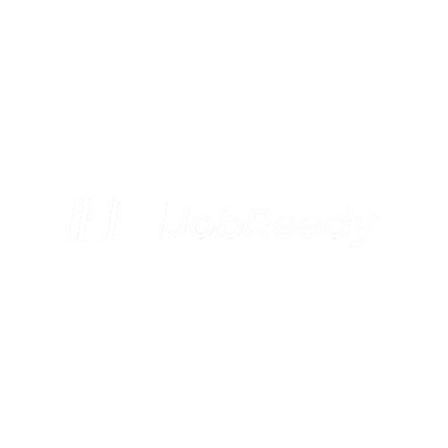

<div align="center">

  

</div>

<!-- ABOUT THE PROJECT -->
## About The Project

This is the React Front End of JobReady! A simple and open-source resume builder.
Remember to get the back end too : https://github.com/Job-Ready/JobReady-Back-End


### Built With

* [![TypeScript][TypeScript.js]][TypeScript-url]
* [![React][React.js]][React-url]
* [![Node.js][Node.js]][Node-url]


<!-- GETTING STARTED -->
## Getting Started

To get a local copy up and running follow these simple example steps.

### Prerequisites

This is an example of how to list things you need to use the software and how to install them.
* npm
  ```sh
  npm install npm@latest -g
  ```

### Installation

1. Clone the repo
   ```sh
   git clone https://github.com/Job-Ready/JobReady-Front-End.git
   ```
2. Install NPM packages
   ```sh
   npm install
   ```
3. Run the project
   ```sh
   npm start
   ```

[React.js]: https://img.shields.io/badge/React-20232A?style=for-the-badge&logo=react&logoColor=61DAFB
[React-url]: https://reactjs.org/
[TypeScript.js]: https://img.shields.io/badge/TypeScript-007ACC?style=for-the-badge&logo=typescript&logoColor=white
[TypeScript-url]: https://www.typescriptlang.org/
[Node.js]: https://img.shields.io/badge/Node.js-339933?style=for-the-badge&logo=nodedotjs&logoColor=white
[Node-url]: https://nodejs.org/
